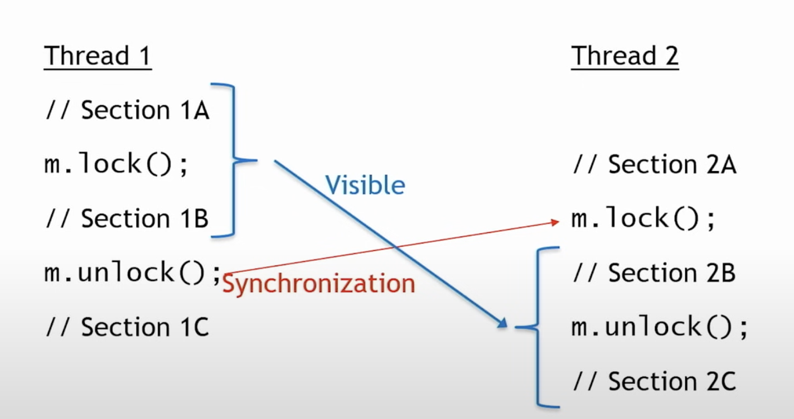
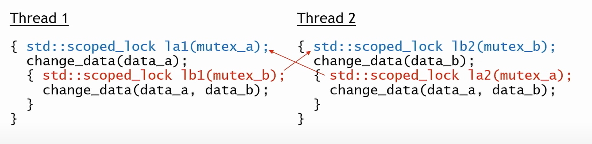
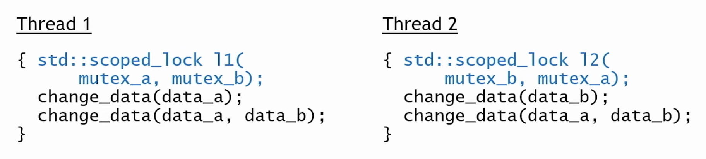

# Concurreny

* Speaker: David Olsen
* Talk: [Concurreny](https://www.youtube.com/watch?v=8rEGu20Uw4g)

### What is Concurreny?

> Multiple logical threads of execution with [some] inter-task dependencies

* Doing things at the same
* Some things need to happen before other things
* Some things can't happen at the same time

### What is Parallelism?

> Multiple logical threads of execution with no inter-task dependencies

### STD::THREAD

```c++
int main() 
{
  std::thread my_thread{[](int z){
    std::cout << "Hello from my thread: " << z << std::endl;
  }, 42};
  
  my_thread.join();
}
```

* Pass a callable to `std::thread` constructor
  * Can be lambda, pointer to a function, std::function, object with a call operator
  * Any arguments to the **callable** are passed as arguments to the thread constructor
  
* `std::thread` constructor creates a new thread and run the callable on that thread (usually immediately)

* Launching a thread is **asynchronous** the main thread and child thread run at the same time

* `join()` waits for the thread to complete, blocking if necessary. It stops the main thread from continuing until the child thread has finished.

* You must call `join()` or `detach()`, or the program will `std::terminate` when the destructor of the thread object is called.

### Data Races (Race Conditions)

> When two or more thing conflict over a resource without coordination with each other

Data race:

* Two or more threads access the same memory
* At least on access is a write
* The threads do no synchronise with each other

A data race is **undefined behaviour**

### Synchronisation techniques

> Synchronisation is all about the visibility of memory changes

#### Mutxes

* **MUT**ual **EX**clusion
* Most basic form of synchronisation
* Only one thread at a time can lock or acquire the mutex
* A mutex takes a potentially concurrent activity and forces it to be sequential
  * As a real world example, the lock on a bathroom door is a mutex
  * Once someone is in the bathroom and has locked the door, they have exclusive use of the bathroom
  * Once they are finished, they can unlock the door and the next person can use it.
  
`std::mutex` is the way of implementing this behaviour in C++.

`void lock();` - Blocks until the lock is acquired

`bool try_lock();` - Returns immediately: `true` if lock acquired; false if not

`void unlock();` - Releases the lock/mutex, UB if current thread didn't originally call lock. 

*Note:* A locked mutex **must** be paired with an unlock, otherwise all other threads will hang when trying to `lock()`

It is non-copyable and non-moveable. There is no way to determine whether a mutex is locked or which thread has locked the mutex.



1. Mutual Exclusion (Mutex):
  * Only one thread can hold the lock at a time.
  * `Sections 1B` and `2B` are critical sections — they access shared data and must not run concurrently.


2. Synchronisation:
  * The "Synchronisation" arrow shows that m.unlock() in Thread 1 synchronises with `m.lock()` in Thread 2.
  * If Thread 2 tries to take the lock at the same time as Thread 1, or whilst Thread 1 has the lock, it will wait (block) until Thread 1 has called unlock.
  * This ensures that all memory writes in `Section 1B` are visible to Thread 2 after it acquires the lock.


3. Memory Visibility:
  * The "Visible" arrow indicates that changes made by Thread 1 in Section 1B **become visible** to Thread 2 in `Section 2B`.
  * This is due to the happens-before relationship established by the mutex.
  
Without proper synchronisation, threads might see stale or inconsistent data. Using `std::mutex` ensures:

* Atomicity: Only one thread modifies shared data at a time.
* Visibility: Changes made by one thread are visible to others after synchronisation.

#### Lock Guards

RAII wrapper around mutexes

* Constructor calls `lock()`
* Destructor calls `unlock()`
* Guarantees that the mutex is always released

Examples:

* `scoped_lock lock(mutex1, mutex1)` - Can lock and unlock multiple mutexes
* `lock_guard<std::mutex> lock(mutex1)` - Can lock and unlock only one mutex
* `std::unique_lock lock{mutex1}` - Has `lock`, `try_lock`, `unlock`, etc methods

#### Mutex Gotchas - Deadlocks

* When multiple mutexes are locked at the same time, they must always be locked in the same order



If both threads reach these blocks at about the same time, the following will happen:
* Thread 1 will lock `mutex_a`, and Thread 2 will lock `mutex_b`
* After doing the first part of the work, each thread will try to lock the other mutex
* Thread 1 is **blocked** trying to acquire `mutex_b`, which is owned by Thread 2
* Thread 2 is **blocked** trying to acquire `mutex_a`, which is owned by Thread 1
* Thread 1 will never release `mutex_a` as it is blocked by `mutex_b`
* Thread 2 will never release `mutex_b` as it is blocked by `mutex_a`
* Both threads have come to an halt

This scenario can be avoided by passing multiple mutexes to std::scoped_lock in its constructor. It will lock and unlock the mutexes in the correct order. It will hold one lock slightly longer than is needed, but will fix the deadlock issue.



#### std::atomic

std::atomic guarantees that if two threads access the same variable in memory, even for writing, it will not lead to a data race.

#### std::shared_mutex

The `shared_mutex` known as a read-write mutex allows multiple threads to read from a mutex at once, but only one thread to write.

An analogy can be a highway
* Cars can freely drive on a highway
* If the highway needs road works, then the maintenance team take the lock
* No other cars can continue to drive whilst the maintenance team has the lock


