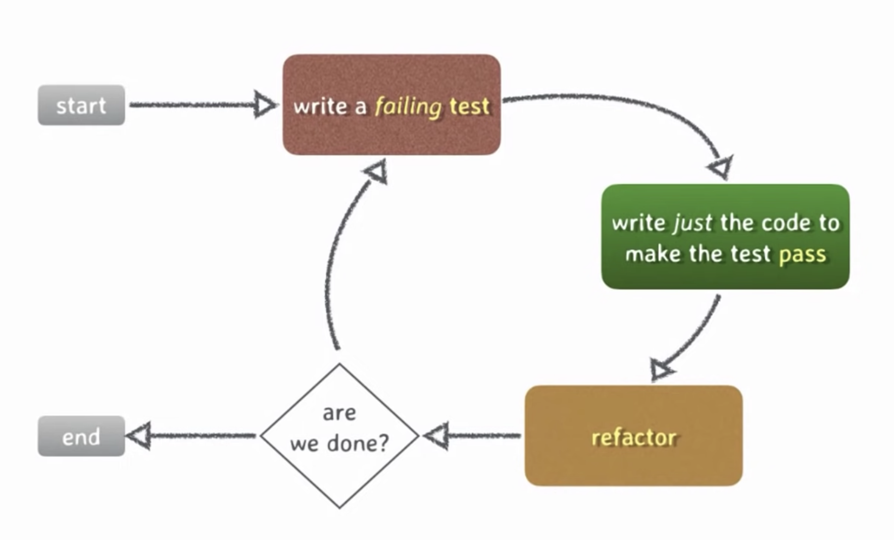

## TDD

* Speaker: Phil Nash
* Talk: [Test Driven C++](https://youtu.be/N2gTxeIHMP0)

### What is TDD?

* **T**est
* **D**riven
* **D**evelopment/Design

> You should be writing your tests first

#### The TDD Cycle

* If the tests are failing or are difficult to write, it can be the sign of a code smell.

* Most of the TTD cycles should be in the order of seconds.

* An [Example](https://youtu.be/N2gTxeIHMP0?t=1593) is given in the talk
