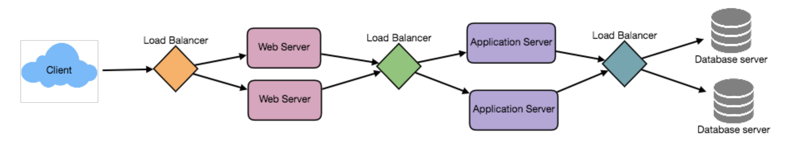

# System Design Basics

## Key characteristics of Distributed Systems

### Scalability

* The ability to grow and manage increased demand.

* Any system that can continuously evolve in order to support the growing amount of work is considered to be scaleable.

* A scalable system would like to achieve scaling without performance loss.

* A scalable architecture tries to avoid decrease in performance by balancing load on all the participating nodes evenly.

**Horizontal scaling** - Adding more servers into your pool of resources.
  * Cassandra and MongoDB
**Vertical scaling** - adding more power (CPU, RAM, Storage) to an existing server.
  * My SQL

### Reliability

The probability that a system will fail in a given period.

A system is considered reliable if it keeps delivering its services even when one or several of its software or hardware components fail.

One way to manage this is through redundancy. Having backups to replace failing components.

### Availability

The time a system remains operational to perform its required function in a specific period.

#### Availability vs Reliability

If a system is reliable, it is available.

If it is available it is not necessarily reliable.

### Efficiency

Two standard methods of efficiency are;
* The response time of a system (latency) i.e the delay to obtain the first item
* The throughput (bandwidth) which denotes the number of items delivered in a given unit of time.

### Service manageability

The simplicity and speed with which a system can be repaired or maintained.

If the time to fix a failed system increases, then the availability decreases.

Things to consider are the ease of diagnosing and understanding problems, making updates and modifications and how simple it is to operate.

## Load Balancing

Helps to spread the traffic across a cluster of servers to improve responsiveness and availability of applications, websites or databases.

It also keeps track of resources whilst distributing requests.

It usually sits between the client and the server, and by balancing application requests across multiple servers, reduces individual server load and prevents any one application server form becoming a single point of failure.

We can try to balance the load at each level of the system:

* Between the user and the web server
* Between web servers and an internal platform layer, like application server or cache servers
* Between internal platform layer and database

### Benefits of load balancing

* User experience a faster, uninterrupted service. Requests as passed on to more readily available resources.

* Service providers experience less downtime and higher throughput. Server failure can be avoided through the LB routing to a healthy server.

* Smart LBs can provide usage analytics to help drive business decisions.

* System administrators experience fewer failed or stressed components.

### Load balancing algorithms

* **Health checks** - LB tries to connect to servers. If server connection fails, it is removed from the pool

Different types of load balancing techniques:
* Least connection - Directs traffic to the server with the fewest active connections
* Least Response Time - Server with the fewest active connections and lowest average response time
* Least bandwidth - Currently serving the least amount of traffic (measured in Mbps)
* Round Robin - Cycles through and sends requests to a list of servers. Useful when servers are of equal spec and capacity
* Weighted Round Robin - as above, but servers have rankings

### Redundant Load Balancers

An LB can form a single point of failure in a system.

Add redundancy to mitigate against this.

## Caching

Caching enables you to make better use of the resources you already have.

Make use of the locality principle: Recently requested data is likely to be requested again.

### Application server cache

Enables the local storage of response data.

Can have cache on each node, but if the load balancer distributes to multiple nodes, you can increase cache misses.

Thus you can have global caches or distributed caches.

### Content Distribution Network (CDN)

A request will ask the CDN for a piece of static media.

The CDN will serve that content if it has it locally available.

If not, the CDN will query the back-end servers for the file, cache it locally and serve it to the requesting user.

### Cache Invalidation

* **Write-through cache**: Data is written into the cache and the database at the same time.
  * Data never goes out of sync
  * Ensures backups if crashes, power failures, etc occur
  * Increases latency as every write has to happen twice

* **Write-around cache**: Data is written directly to permanent storage
  * Reduces cache flooding

* **Write-back cache**: Data is written only to the cache and writes to permanent storage are done at specified intervals or under certain conditions. This results in lower latency but increases vulnerability with regards to data loss.

### Cache eviction policies

* FIFO: First block is evicted without any regard to frequency of access
* LIFO: The most recent block is evicted without any regard to frequency of access
* Least Recently Used (LRU): Evicts the least recently used items first.
* Most Recently Used (MRU): Evicts the most recently used items first.
* Least Frequently Used (LFU): Counts how often an item is needed.
Those that are used least often are discarded first.
* Random Replacement (RR): Randomly selects a candidate item and discards it to make space when necessary.

### Sharding or Data Partitioning

The process of splitting up a DB/table across multiple machine to improve the manageability, performance and availability.

Justification is that it is often cheaper and more feasible to scale horizontally and increase the number of servers than get more performant servers machines.

**1. Partitioning Methods**

* a. Horizontal Partitioning (range based sharding) - Splitting via ranges
  * Can lead to unbalanced servers if not split effectively

* b. Vertical Partitioning: Partition based on feature
  * may require further splitting as feature content grows

* c. Directory Based Partitioning:

**2. Partitioning Criteria**

* a. Key or hash-based partitioning: Apply hash function to the key attributes, that yields the partition number.
  * Fixes the total number of DB servers since adding a new server would change the hash and require re-distribution and downtime.

* b. list partitioning: group related items together by a shared feature

* c. Round-robin partitioning: i % n distribution

* d. Composite partitioning: Combine schemes above to new scheme

**3. Common problem of sharding**

> TODO

## CAP Theorem

States that it is impossible for a distributed system to simultaneously provide more than two of the three following guarantees:
* **C**onsistency
* **A**vailability
* **P**artition tolerance

* **Consistency**: All nodes see the same data at the same time.
* **Availability**: Every request gets a response on success/failure. Replicate the data across different servers
* **Partition tolerance**: The system continues to work despite message loss or partial failure.
